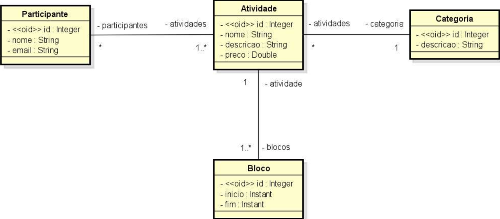
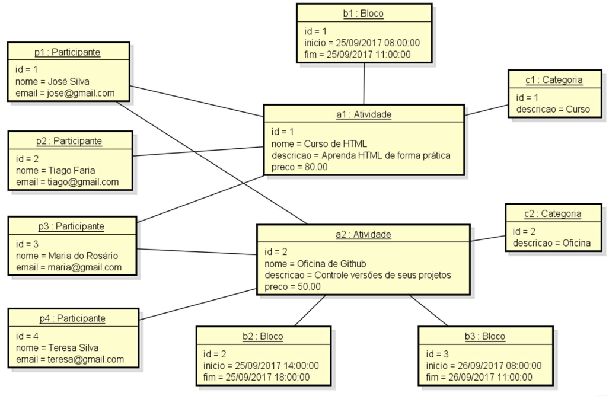

# 🎓 Sistema de Gerenciamento de Atividades de Evento Acadêmico

Este projeto faz parte de um desafio do curso **Java Spring Professional** da [DevSuperior](https://devsuperior.com.br/). O objetivo é criar um sistema para gerenciar as informações dos participantes e atividades de um evento acadêmico, utilizando **Java 21**, **Spring Boot**, **Maven**, **Spring Data JPA**, e **H2 Database**.

## 📋 Descrição do Projeto

O sistema permite o gerenciamento de atividades de eventos acadêmicos, como palestras, cursos e oficinas. Cada atividade possui nome, descrição, preço e pode ser dividida em múltiplos blocos de horários. Os participantes podem ser cadastrados com seu nome e email, e poderão ser associados a diferentes atividades.

## 🛠️ Tecnologias Utilizadas

- **Java 21**
- **Spring Boot**
- **Maven**
- **Spring Data JPA**
- **H2 Database**
- **Spring Web**

## 🛠️ Estrutura do Projeto

A solução foi desenvolvida seguindo a arquitetura de Modelo de Domínio e ORM, conforme o diagrama abaixo:

### Diagrama de Classes



### Diagrama de Objetos



## 🏗️ Estrutura do Código

O projeto segue uma estrutura organizada, com os serviços implementados como componentes Spring anotados com `@Service`.

```text
src
├── main
│   ├── java
│   │   └── com
│   │       └── devsuperior
│   │           └── desafio2
│   │               ├── entities
│   │               │   ├── Atividade.java
│   │               │   ├── Bloco.java
│   │               │   ├── Categoria.java
│   │               │   └── Participante.java
│   │               └── Desafio2Application.java
│   └── resources
│       ├── application.properties
│       ├── application-test.properties
│       └── import.sql
└── test
```

## ⚙️ Pré-requisitos

- Java JDK 21 ou superior
- Maven
- Spring Boot

## 🚀 Como Executar o Projeto

1. Clone o repositório:

   ```bash
   git clone https://github.com/PedroHFG/javaspring-professional-desafio2
   ```

2. Navegue até a pasta do projeto:

   ```bash
   cd javaspring-professional-desafio2
   ```

3. Compile o projeto Maven:

   ```bash
   mvn clean install
   ```

4. Execute a aplicação

   ```bash
   mvn spring-boot:run
   ```

5. Acesse o H2 Console. O banco de dados H2 estará disponível no navegador. Acesse-o através do link:

   ```bash
   http://localhost:8080/h2-console
   ```

## 📦 Seeding de Dados

Os dados iniciais são inseridos automaticamente no banco de dados ao iniciar a aplicação, utilizando o arquivo import.sql. As tabelas esperadas, com seus relacionamentos, serão criadas corretamente e preenchidas com dados de exemplo.

## 🗄️ Configuração do Banco de Dados

O projeto utiliza o H2 Database em modo memória. As configurações podem ser encontradas no arquivo application.properties:

```bash
   # Dados de conexão com o banco H2
   spring.datasource.driverClassName=org.h2.Driver
   spring.datasource.url=jdbc:h2:mem:testdb
   spring.datasource.username=sa
   spring.datasource.password=
   # H2 Client
   spring.h2.console.enabled=true
   spring.h2.console.path=/h2-console
   # JPA, SQL
   spring.jpa.database-platform=org.hibernate.dialect.H2Dialect
   spring.jpa.defer-datasource-initialization=true
   spring.jpa.show-sql=true
   spring.jpa.properties.hibernate.format_sql=true
```

## 📞 Contato

Se você tiver dúvidas ou sugestões sobre o projeto, sinta-se à vontade para entrar em contato:

- **Email**: pedrohfidg@gmail.com
- **GitHub**: [PedroHFG](https://github.com/PedroHFG)
